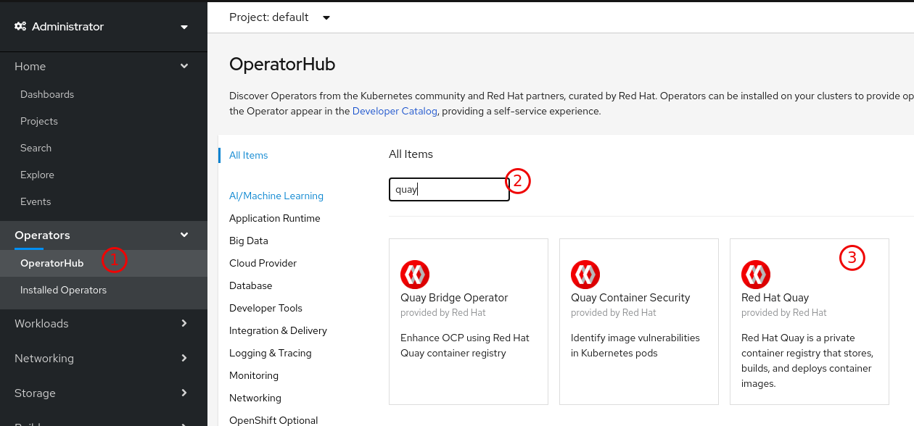

# instalação do quay via operator

A instalação do quay pode ser feita via operator openshift 4.


## Pré requisitos
Conforme a documentação [Deployments em produção](https://access.redhat.com/documentation/en-us/red_hat_quay/3.3/html/deploy_red_hat_quay_on_openshift_with_quay_operator/deploying_red_hat_quay#production_deployments) os seguintes pontos merecem atenção especial:

- Recursos computacionais (requerimento mínimo) 
- Storage para armazenamento das imagens
- Banco de dados para o Quay
- Banco de dados para o clair
- Certificado digital para acesso ao registry Quay

### Recursos computacionais

Os recursos computacionais necessários para a instalação em produção irá depender da carga a ser despreendida no processamento e escaneamento das imagens.

Para uma estimativa melhor analisar a carga com o uso e definir um limite próximo dos valores encontrados.

### Storage de armazenamento das imagens

Para que seja possível o armazenamento das imagens, é um pré requisito a configuração de um mecanismo de storage.

A instalação do quay via operator openshift suporta as seguintes storages conforme a [documentação de HA do quay](https://access.redhat.com/documentation/en-us/red_hat_quay/3.3/html-single/deploy_red_hat_quay_-_high_availability/index#prerequisites):

- Amazon S3 
- Azure Blob Storage
- Google Cloud Storage
- Ceph Object Gateway
- OpenStack Swift
- CloudFront + S3
- NooBaa S3 Storage (Technology Preview)


Para detalhes de cada storage acesse a [documentação e veja o tipo de parametros a serem preenchidos para o backend escolhido](https://access.redhat.com/documentation/en-us/red_hat_quay/3.3/html/deploy_red_hat_quay_on_openshift_with_quay_operator/customizing_your_red_hat_quay_cluster#registry_storage_backend_types).

### Banco de dados Quay

O quay utiliza um banco de dados postgres em sua instalação, para tanto o quay tem a habilidade de lidar com o banco de dados de 2 formas:

- instancia gerenciada
- instancia externa

*Instancia gerenciada* 

Utiliza um banco de dados que é instalado diretamente no openshift que isoladamente fornece as funcionalidades necessárias para executar o quay.

*Instancia externa*

A Instancia externa é fornecida para a instalação repassando as credenciais e informações de conexão para o operator.

Certifique-se de garantir que o banco de dados tenha a extensão `pg_trgm` disponível no banco de dados. Caso não tenha, basta executar o comando abaixo para adicionar a extensão ao banco. Caso ocorra um erro abaixo consulte a [documentação do quay](https://access.redhat.com/documentation/en-us/red_hat_quay/3.3/html-single/deploy_red_hat_quay_-_high_availability/index#set_up_load_balancer_and_database) para procedimentos de instalação da extensão `pg_trgm`.

```psql
\c <quay-database>;
CREATE EXTENSION IF NOT EXISTS pg_trgm;
```

### Banco de dados Clair

Assim como o quay, o clair utiliza um banco de dados postgres para armazenamento de dados referentes ao scanning das imagens. A forma de operar é exatamente a mesma do quay e os procedimentos citados na seção [Banco de dados Quay](#Banco de dados Quay).

### Certificado digital para acesso ao registry Quay

O procedimento de instalação do quay requer que a rota configurada apresente um certificado válido. O não cumprimento dessa exigência, pode requer configurações adicionais que podem tornar a solução vunerável e não fazem parte do escopo deste documento.


## Instalação do Quay

Para a instalação do quay é necessário a instalação no cluster openshift do operador do quay.

Os passos abaixo são para uma instalação de quay que utiliza uma storage local com o quay e clair instalados usando os certificados providos pelo openshift no router. O banco de dados é uma instalação externa de postgres para o quay e clair.

Para tanto são necessários os seguintes procedimentos:

### 1 - Criação do projeto `quay-enterprise`

Neste projeto serão armazenados as configurações de execução e os containers para execução do operador e registry Quay.

### 2 - Instalação do quay operator 

A instalação do quay operator é feita via operator hub, conforme imagem abaixo:



### 3 - Credencial para download das imagens

Deverá ser fornecido na instalação do quay uma credencial para download das imagens do quay dos repositórios da Red Hat.

Para a criação da credencial [acesse a solution para obter uma secret com as credenciais de acesso aos registries da redhat](https://access.redhat.com/solutions/3533201), e execute os procedimentos de instalação da secret `redhat-pull-secret` no projeto `quay-enterprise`.


### 4 - Criação das secrets de banco de dados

Para que o quay e o clair acessem o banco de dados é necessário a criação das secrets que conterão acesso ao banco de dados, são necessários permissão de DDL para o usuário no banco de dados especificado.

O comando abaixo cria as secrets de acesso ao quay e clair.

```bash
oc create secret generic db-quay-secret \
    --from-literal=database-username=<usuario do db quay> \
    --from-literal=database-password=<senha do db quay> \
    --from-literal=database-root-password=<senha do db quay>  \
    --from-literal=database-name=<nome do banco do quay>


oc create secret generic db-clair-secret \
    --from-literal=database-username=<usuario do db clair> \
    --from-literal=database-password=<senha db clair> \
    --from-literal=database-root-password=<senha db clair> \
    --from-literal=database-name=<nome do banco do clair>
```

### 5 - Secret do certificado TLS

Como o registry quay é um registry seguro, é necessário que seja fornecido uma chave TLS para a instalação.

Estes certificados serão usados para customização do TLS de acesso aos recursos do registry.

Este passo pode ser opcional se deixar a configuração do quay.tls.termination como edge, fazendo com que a terminação SSL ocorra no router do openshift com os certificados instalados no router.

```bash
oc create secret tls custom-quay-ssl \
   --key=<ssl_private_key_file> --cert=<ssl_certificate_file>
```

A documentação referente a estes procedimentos relacionados ao registry são encontrados na [documentação](https://access.redhat.com/documentation/en-us/red_hat_quay/3.3/html/deploy_red_hat_quay_on_openshift_with_quay_operator/customizing_your_red_hat_quay_cluster#providing_ssl_certificates).


### 6 - Instalação do quay via operator

A instalação do quay e clair via operator é feita usando o CRD `QuayEcosystem` disponibilizado pelo quay operator.


```yaml
# caso tenha instalado anteriormente
oc delete -n quay-enterprise quayecosystem/example-quayecosystem

oc apply -n quay-enterprise -f - <<EOF
apiVersion: redhatcop.redhat.io/v1alpha1
kind: QuayEcosystem
metadata:
  name: example-quayecosystem
spec:
  quay:
    # secret usada para acesso ao registry.redhat.io para download das imagens do quay 
    imagePullSecretName: redhat-pull-secret
    database:
      # nome do secret usado para acessar o quay database
      credentialsSecretName: db-quay-secret
      # endereço do servidor postgres no formato <host>:<port>
      server: postgresql.postgres.svc:5432

    externalAccess:
      tls: 
        # nome da secret caso tenha sido feito o passo 5
        secretName: custom-quay-ssl
        # terminação TLS usada na rota
        termination: passthrough

        # Neste exemplo foi usado um registry backend (storage) s3. 
        # A documentação permite a configuração de vários storage backends
        # para outras configurações consulte a documentação nas seções acima
    registryBackends:
      - name: s3
        s3:
          accessKey: <accessKey>
          bucketName: <bucketName>
          secretKey: <secretKey
          host: <host>

  clair:
    # habilita na instalação o clair
    enabled: true
    database:
      # nome da secret usado para acessar o clair database
      credentialsSecretName: db-clair-secret
      # endereço do servidor postgres no formato <host>:<port>
      server: postgresql.postgres.svc:5432
EOF
```

Com essas informações o quay e clair é instalado com acessos.


## Acesso externo ao clair

Para que seja possível a utilização do clair fora do quay para uso por exemplo em um pipeline é necessário a criação de um service e uma rota.


```yaml
oc create -n quay-enterprise -f - <<EOF
kind: Service
apiVersion: v1
metadata:
  name: clair-api-pipeline
  namespace: quay-enterprise
spec:
  ports:
    - name: clair-api-pipeline
      protocol: TCP
      port: 6062
      targetPort: 6062
  selector:
    app: quay-operator
    quay-enterprise-component: clair
    quay-enterprise-cr: example-quayecosystem
EOF
```

Após isso configure uma rota de acesso a este componente. Para testar o seu funcionamento envie uma imagem para o quay e solicite o scanning usando a ferramenta klar. Esta ferramenta klar está disponível no [github do projeto](https://github.com/optiopay/klar). 

```bash
export CLAIR_ADDR=clair-quay-enterprise.apps.cluster-brasilia-44d0.brasilia-44d0.sandbox1489.opentlc.com:80           
export DOCKER_USER=quay
export DOCKER_PASSWORD=password

./klar  example-quayecosystem-quay-quay-enterprise.apps.cluster-brasilia-44d0.brasilia-44d0.sandbox1489.opentlc.com/teste/openjdk:10
```